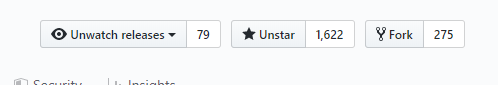
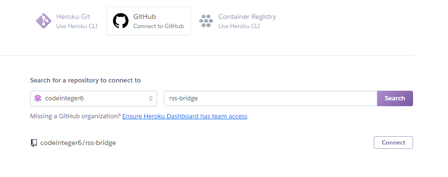

This guide is for people who want to run RSS Bridge on [Heroku](https://heroku.com).

You can run it on Heroku for free, however make sure your RSS reader interval is not set to a fast rate, otherwise your Heroku hours will use up quicker. Heroku puts the app to sleep after 30 mins of no activity. When the app is asleep no Heroku hours are used. So choose an interval that won't make the app exceed the limit!

You can increase your Heroku hours to 1000 a month from 550 a month by simply verifying your account with a credit card.

## Deploy button
You can simply press the button below to easily deploy RSS Bridge on Heroku and use the default bridges. Or you can follow the manual instructions given below.

## Manual deploy
1. Fork this repo by clicking the Fork button at the top right of this page (only on desktop site)

2. To customise what bridges can be used if need, create a `whitelist.txt` file in your fork and follow the instructions given [here](../03_For_Hosts/05_Whitelisting.md). You don’t need to do this if you’re fine with the default bridges.

3. [Log in to Heroku](https://dashboard.heroku.com) and create a new app. The app name will be the URL of the RSS Bridge (appname.herokuapp.com)

4. Go to Deploy, select the GitHub option and connect your GitHub account. Search for the repo named `yourusername/rss-bridge`

5. Deploy the master branch.