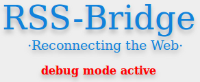

<h1 align="center">Warning!</h1>

Enabling debug mode on a public server may result in malicious clients retrieving sensitive data about your server and possibly gaining access to it. Do not enable debug mode on a public server, unless you understand the implications of your doing!

***

Debug mode enables error reporting and prevents loading data from the cache (data is still written to the cache).
To enable debug mode, create a file named 'DEBUG' in the root directory of RSS-Bridge (next to `index.php`). For further security, insert your IP address in the file. You can add multiple addresses, one per line.

_Notice_:

* An empty file enables debug mode for anyone!
* The bridge whitelist still applies! (debug mode does **not** enable all bridges)

RSS-Bridge will give you a visual feedback when debug mode is enabled:

While debug mode is active, RSS-Bridge will write additional data to your servers `error.log`.

Debug mode is controlled by the static class `Debug`. It provides three core functions:

`Debug::isEnabled()`: Returns `true` if debug mode is enabled.
`Debug::isSecure()`: Returns `true` if your client is on the debug whitelist.
`Debug::log($message)`: Adds a message to `error.log`. It takes one parameter, which can be anything. For example: `Debug::log('Hello World!');`

**Notice**: `Debug::log($message)` calls `Debug::isEnabled()` internally. You don't have to do that manually.