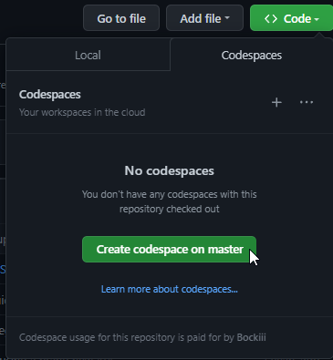
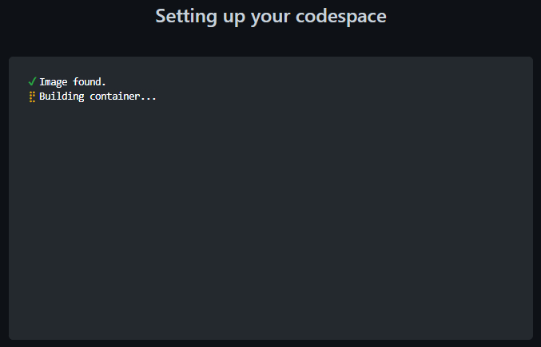
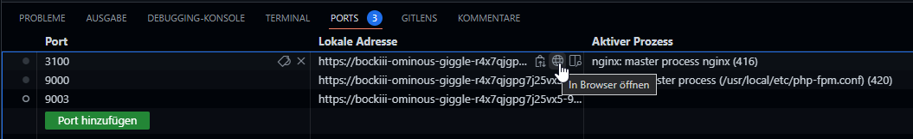
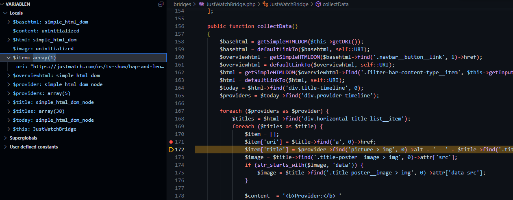

Github Codespaces lets you develop RSS-Bridge right from within your browser in an online hosted environment without the need to install anything. Github Codespaces is free, check out [this](https://github.com/features/codespaces) for more info.

# How to get started

You must enable Codespaces for your account [here](https://github.com/features/codespaces) . After you are enabled to use Codespaces, you will get the additional functionality that you can see in the screenshots below.

# How to develop for RSS-Bridge

This will give you an example workflow of how to create a bridge for RSS-Bridge using codespaces

1. Fork the main RSS-Bridge repo
2. On your own repo, click the "code" icon on the top on your repo and select "Create codespace on master"

   
3. A new window will open and show this screen. This means that your dev environment is being prepared

   
4. When the window has loaded, give it some time to run all the preparation scripts. You will see that it is done when you see a "Listen for Xdebug (rss-bridge)" line in the bottom row

   
5. At this point, there is a running instance of RSS-Bridge active that you can open by clicking on the "PORTS" tab and then on the icon to open the website for port 3100

   
6. Xdebug is already started so you can set breakpoints and check out the variables in the debug pane

   
7. You can now create a new branch for your new bridge by clicking on the "master" entry in the bottom left and select "create new branch" from the menu.
8. You can commit straight from the IDE as your github credentials are already included in the Codespace.
9. To open a PR, either go back to the Github website and open it there or do it right from the Codespaces instance using the github integration (when you push a new branch, it will ask you if you want to open a new PR).

# How-Tos

This guide assumes that you already know the basics of php development, some basics in VScode and some basics in working with git. If you want to know more about any of these steps, check out these How-Tos
* Check [How to create a new Bridge](../05_Bridge_API/01_How_to_create_a_new_bridge.md) on how to do that.
* Check [This Youtube Tutorial](https://youtu.be/i_23KUAEtUM?t=54) for a quick introduction to using VSCode with Git (ignore the initial git setup, Codespaces does that for you)