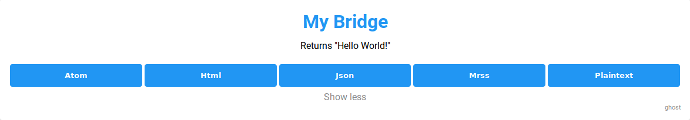
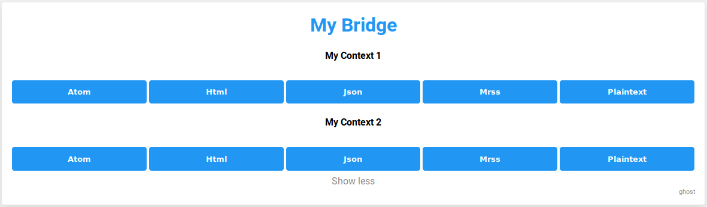
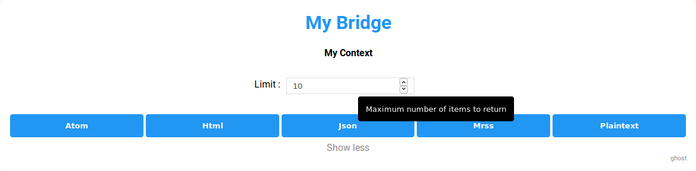

`BridgeAbstract` is a base class for standard bridges.
It implements the most common functions to simplify the process of adding new bridges.

***

# Creating a new bridge

You need four basic steps in order to create a new bridge:

[**Step 1**](#step-1---create-a-new-file) - Create a new file
[**Step 2**](#step-2---add-a-class-extending-bridgeabstract) - Add a class, extending `BridgeAbstract`
[**Step 3**](#step-3---add-general-constants-to-the-class) - Add general constants to the class
[**Step 4**](#step-4---implement-a-function-to-collect-feed-data) - Implement a function to collect feed data

These steps are described in more detail below.
At the end of this document you'll find a complete [template](#template) based on these instructions.
The pictures below show an example based on these instructions:

<details><summary>Show pictures</summary><div>



***


</div></details><br>

Make sure to read these instructions carefully.
Please don't hesitate to open an 
[Issue](https://github.com/RSS-Bridge/rss-bridge/issues)
if you have further questions (or suggestions).
Once your bridge is finished, please open a [Pull Request](https://github.com/RSS-Bridge/rss-bridge/pulls),
in order to get your bridge merge into RSS-Bridge.

***

## Step 1 - Create a new file

Please read [these instructions](./01_How_to_create_a_new_bridge.md) on how to create a new file for RSS-Bridge.

## Step 2 - Add a class, extending `BridgeAbstract`

Your bridge needs to be a class, which extends `BridgeAbstract`.
The class name must **exactly** match the name of the file, without the file extension.

For example: `MyBridge.php` => `MyBridge`

<details><summary>Show example</summary><div>

```PHP
<?PHP
class MyBridge extends BridgeAbstract
{

}
```

</div></details>

## Step 3 - Add general constants to the class

In order to present your bridge on the front page, RSS-Bridge requires a few constants:

```PHP
const NAME          // Name of the Bridge (default: "Unnamed Bridge")
const URI           // URI to the target website of the bridge (default: empty)
const DESCRIPTION   // A brief description of the Bridge (default: "No description provided")
const MAINTAINER    // Name of the maintainer, i.e. your name on GitHub (default: "No maintainer")
const PARAMETERS    // (optional) Definition of additional parameters (default: empty)
const CACHE_TIMEOUT // (optional) Defines the maximum duration for the cache in seconds (default: 3600)
```

<details><summary>Show example</summary><div>

```PHP
<?php

class MyBridge extends BridgeAbstract
{
	const NAME        = 'My Bridge';
	const URI         = 'https://rss-bridge.github.io/rss-bridge/Bridge_API/BridgeAbstract.html';
	const DESCRIPTION = 'Returns "Hello World!"';
	const MAINTAINER  = 'ghost';
}
```

</div></details><br>

**Notice**: `const PARAMETERS` can be used to request information from the user.
Refer to [these instructions](#parameters) for more information.

## Step 4 - Implement a function to collect feed data

In order for RSS-Bridge to collect data, you must implement the **public** function `collectData`.
This function takes no arguments and returns nothing.
It generates a list of feed elements, which must be placed into the variable `$this->items`.

<details><summary>Show example</summary><div>

```PHP
<?php

class MyBridge extends BridgeAbstract
{
    const NAME        = 'My Bridge';
    const URI         = 'https://rss-bridge.github.io/rss-bridge/Bridge_API/BridgeAbstract.html';
    const DESCRIPTION = 'Returns "Hello World!"';
    const MAINTAINER  = 'ghost';

    public function collectData()
    {
        $item = [];
        $item['title'] = 'Hello World!';
        $this->items[] = $item;
    }
}
```

</div></details><br>

For more details on the `collectData` function refer to [these instructions](#collectdata).

***

# Template

Use this template to create your own bridge.
Please remove any unnecessary comments and parameters.

```php
<?php

class MyBridge extends BridgeAbstract
{
    const NAME = 'Unnamed bridge';
    const URI = '';
    const DESCRIPTION = 'No description provided';
    const MAINTAINER = 'No maintainer';
    const PARAMETERS = []; // Can be omitted!
    const CACHE_TIMEOUT = 3600; // Can be omitted!
    
    public function collectData()
    {
        $item = []; // Create an empty item
    
        $item['title'] = 'Hello World!';
    
        $this->items[] = $item; // Add item to the list
    }
}
```

# PARAMETERS

You can specify additional parameters in order to customize the bridge (i.e. to specify how many items to return).
This document explains how to specify those parameters and which options are available to you.

For information on how to read parameter values during execution, please refer to the [getInput](../06_Helper_functions/index.md#getinput) function.

***

## Adding parameters to a bridge

Parameters are specified as part of the bridge class.
An empty list of parameters is defined as `const PARAMETERS = [];`

<details><summary>Show example</summary><div>

```PHP
<?php

class MyBridge extends BridgeAbstract {
	/* ... */
	const PARAMETERS = []; // Empty list of parameters (can be omitted)
	/* ... */
}
```

</div></details><br>

Parameters are organized in two levels:

[**Level 1**](##level-1---context) - Context
[**Level 2**](##level-2---parameter) - Parameter

## Level 1 - Context

A context is defined as a associative array of parameters.
The name of a context is displayed by RSS-Bridge.

<details><summary>Show example</summary><div>

```PHP
const PARAMETERS = [
	'My Context 1' => [],
	'My Context 2' => [],
];
```

**Output**



</div></details><br>

_Notice_: The name of a context can be left empty if only one context is needed!

<details><summary>Show example</summary><div>

```PHP
const PARAMETERS = [
	[]
];
```

</div></details><br>

You can also define a set of parameters that will be applied to every possible context of your bridge.
To do this, specify a context named `global`.

<details><summary>Show example</summary><div>

```PHP
const PARAMETERS = [
	'global' => [] // Applies to all contexts!
];
```

</div></details>

## Level 2 - Parameter

Parameters are placed inside a context.
They are defined as associative array of parameter specifications.
Each parameter is defined by it's internal input name, a definition in the form `'n' => [];`, 
where `n` is the name with which the bridge can access the parameter during execution.

<details><summary>Show example</summary><div>

```PHP
const PARAMETERS = [
    'My Context' => [
        'n' => [],
    ]
];
```

</div></details><br>

The parameter specification consists of various fields, listed in the table below.

<details><summary>Show example</summary><div>

```PHP
const PARAMETERS = [
	'My Context' => [
		'n' => [
			'name' => 'Limit',
			'type' => 'number',
			'required' => false,
			'title' => 'Maximum number of items to return',
			'defaultValue' => 10,
		]
	]
];
```

**Output**



</div></details>

***

Parameter Name | Required | Type | Supported values | Description
---------------|----------|------|------------------| -----------
`name` | **yes** | Text | | Input name as displayed to the user
`type` | no | Text | `text`, `number`, `list`, `checkbox` | Type of the input (default: `text`)
`required` | no | Boolean | `true`, `false` | Specifies if the parameter is required or not (default: `false`). Not supported for lists and checkboxes.
[`values`](#list-values) | no | associative array | | name/value pairs used by the HTML option tag, required for type '`list`'
`title` | no | Text | | Used as tool-tip when mouse-hovering over the input box
`pattern` | no | Text | | Defines a pattern for an element of type `text`. The pattern should be mentioned in the `title` attribute!
`exampleValue` | no | Text | | Defines an example value displayed for elements of type `text` and `number` when no data has been entered yet
[`defaultValue`](#defaultvalue) | no | | | Defines the default value if left blank by the user

#### List values

List values are defined in an associative array where keys are the string displayed in the combo list of the **RSS-Bridge** web interface, and values are the content of the \<option\> HTML tag value attribute.

```PHP
...
    'type' => 'list',
    'values' => [
        'Item A' => 'itemA'
        'Item B' => 'itemB'
     ]
...
```

If a more complex organization is required to display the values, the above key/value can be used to set a title as a key and another array as a value:

```PHP
...
    'type' => 'list',
    'values' => [
        'Item A' => 'itemA',
        'List 1' => [
            'Item C' => 'itemC',
            'Item D' => 'itemD'
        ],
        'List 2' => [
            'Item E' => 'itemE',
            'Item F' => 'itemF'
        ],
        'Item B' => 'itemB'
    ]
...
```

#### defaultValue

This attribute defines the default value for your parameter. Its behavior depends on the `type`:

- `text`: Allows any text
- `number`: Allows any number
- `list`: Must match either name or value of one element
- `checkbox`: Must be "checked" to activate the checkbox

***

# queriedContext

The queried context is defined via `PARAMETERS` and can be accessed via `$this->queriedContext`.
It provides a way to identify which context the bridge is called with.

Example:

```PHP
const PARAMETERS = [
    'By user name' => [
        'u' => ['name' => 'Username']
    ],
    'By user ID' => [
        'id' => ['name' => 'User ID']
    ]
];
```

In this example `$this->queriedContext` will either return **By user name** or **By user ID**.
The queried context might return no value, so the best way to handle it is by using a case-structure:

```PHP
switch($this->queriedContext){
	case 'By user name':
		break;
	case 'By user ID':
		break;
	default: // Return default value
}
```

# collectData

The `collectData` function is responsible for collecting data and adding items to generate feeds from.
If you are unsure how to solve a specific problem, please don't hesitate to open an [Issue](https://github.com/RSS-Bridge/rss-bridge/issues) on GitHub.
Existing bridges are also a good source to learn implementing your own bridge.

## Implementing the `collectData` function

Implementation for the `collectData` function is specific to each bridge.
However, there are certain reoccurring elements, described below. RSS-Bridge also provides functions to simplify the process of collecting and parsing HTML data (see "Helper Functions" on the sidebar)

Elements collected by this function must be stored in `$this->items`.
The `items` variable is an array of item elements, each of which is an associative array that may contain arbitrary keys.
RSS-Bridge specifies common keys which are used to generate most common feed formats.

<details><summary>Show example</summary><div>

```PHP
$item = [];
$item['title'] = 'Hello World!';
$this->items[] = $item;
```

</div></details><br>

Additional keys may be added for custom APIs (ignored by RSS-Bridge).

## Item parameters

The item array should provide as much information as possible for RSS-Bridge to generate feature rich feeds.
Find below list of keys supported by RSS-Bridge.

```PHP
$item['uri']        // URI to reach the subject ("https://...")
$item['title']      // Title of the item
$item['timestamp']  // Timestamp of the item in numeric or text format (compatible for strtotime())
$item['author']     // Name of the author for this item
$item['content']    // Content in HTML format
$item['enclosures'] // Array of URIs to an attachments (pictures, files, etc...)
$item['categories'] // Array of categories / tags / topics
$item['uid']        // A unique ID to identify the current item
```

All formats support these parameters. The formats `Plaintext` and `JSON` also support custom parameters.

# getDescription

The `getDescription` function returns the description for a bridge.

**Notice:** By default **RSS-Bridge** returns the contents of `const DESCRIPTION`,
so you only have to implement this function if you require different behavior!

```PHP
public function getDescription()
{
    return self::DESCRIPTION;
}
```

# getMaintainer

The `getMaintainer` function returns the name of the maintainer for a bridge.

**Notice:** By default **RSS-Bridge** returns `const MAINTAINER`,
so you only have to implement this function if you require different behavior!

```PHP
public function getMaintainer()
{
    return self::MAINTAINER;
}
```

# getName

The `getName` function returns the name of a bridge.

**Notice:** By default **RSS-Bridge** returns `const NAME`,
so you only have to implement this function if you require different behavior!

```PHP
public function getName()
{
    return self::NAME;
}
```

# getURI

The `getURI` function returns the base URI for a bridge.

**Notice:** By default **RSS-Bridge** returns `const URI`,
so you only have to implement this function if you require different behavior!

```PHP
public function getURI()
{
    return self::URI;
}
```

# getIcon

The `getIcon` function returns the URI for an icon, used as favicon in feeds.

If no icon is specified by the bridge,
RSS-Bridge will use a default location: `static::URI . '/favicon.ico'` (i.e. "https://github.com/favicon.ico") which may or may not exist.

```PHP
public function getIcon()
{
    return static::URI . '/favicon.ico';
}
```

# detectParameters

The `detectParameters` function takes a URL and attempts to extract a valid set of parameters for the current bridge.

If the passed URL is valid for this bridge, the function should return an array of parameter -> value pairs that can be used by this bridge, including context if available, or an empty array if the bridge requires no parameters. If the URL is not relevant for this bridge, the function should return `null`.

**Notice:** Implementing this function is optional. By default, **RSS-Bridge** tries to match the supplied URL to the `URI` constant defined in the bridge, which may be enough for bridges without any parameters defined.

```PHP
public function detectParameters($url)
{
    $regex = '/^(https?:\/\/)?(www\.)?(.+?)(\/)?$/';
    if (empty(static::PARAMETERS)
        && preg_match($regex, $url, $urlMatches) > 0
        && preg_match($regex, static::URI, $bridgeUriMatches) > 0
        && $urlMatches[3] === $bridgeUriMatches[3]
    ) {
        return [];
    } else {
        return null;
    }
}
```

**Notice:** This function is also used by the [findFeed](../04_For_Developers/04_Actions.md#findfeed) action.
This action allows an user to get a list of all feeds corresponding to an URL.

You can implement automated tests for the `detectParameters` function by adding the `TEST_DETECT_PARAMETERS` constant to your bridge class constant.

`TEST_DETECT_PARAMETERS` is an array, with as key the URL passed to the `detectParameters`function and as value, the array of parameters returned by `detectParameters` 

```PHP
const TEST_DETECT_PARAMETERS = [
    'https://www.instagram.com/metaverse' => ['context' => 'Username', 'u' => 'metaverse'],
    'https://instagram.com/metaverse' => ['context' => 'Username', 'u' => 'metaverse'],
    'http://www.instagram.com/metaverse' => ['context' => 'Username', 'u' => 'metaverse'],
];
```

**Notice:** Adding this constant is optional. If the constant is not present, no automated test will be executed.


***

# Helper Methods

`BridgeAbstract` implements helper methods to make it easier for bridge maintainers to create bridges.
Use these methods whenever possible instead of writing your own.

## saveCacheValue

Within the context of the current bridge, stores a value by key in the cache.
The value can later be retrieved with [loadCacheValue](#loadcachevalue).

```php
protected function saveCacheValue($key, $value, $ttl = null)
```

Example:

```php
public function collectData()
{
    $this->saveCacheValue('my_key', 'my_value', 3600); // 1h
}
```

## loadCacheValue

Within the context of the current bridge, loads a value by key from cache.
Optionally specifies the cache duration for the key.
Returns `null` if the key doesn't exist or the value is expired.

```php
protected function loadCacheValue($key, $default = null)
```

Example:

```php
public function collectData()
{
    $value = $this->loadCacheValue('my_key');

    if (! $value) {
        $this->saveCacheValue('my_key', 'foobar');
    }
}
```
